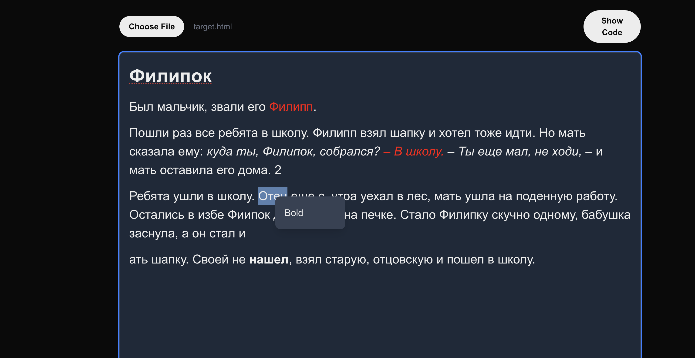

# HTML Editor



This page is an HTML editor with two viewing modes. Here are the main features:

## File Loading
- Button for uploading HTML files (.html, .htm)
- File content is displayed in the editor upon loading

## Two Operating Modes (toggled with "Show Code"/"Preview HTML" button)
### Preview Mode (default):
- Displays rendered HTML
- Allows visual content editing through contentEditable
- Changes are immediately reflected in the fileContent state

### Code Mode:
- Shows HTML code in text form via textarea
- Allows direct HTML markup editing

## Content Synchronization
- Changes in any mode are synchronized between modes
- The latest content version is preserved when switching modes

## Cursor Position Preservation
- Attempts to maintain cursor position when editing in Preview mode
- Uses useEffect to restore position after DOM updates

## Styling
- Responsive design
- Dark theme support
- Styled buttons and input fields
- Full-screen editor with scrolling

## Technical Features
- Uses React hooks (useState, useRef, useEffect)
- Works with DOM API for text selection management
- Uses FileReader for file loading
- Implements error handling for DOM operations
- Client-side component ("use client")
- Component-based architecture for better maintainability

This is a [Next.js](https://nextjs.org) project bootstrapped with [`create-next-app`](https://nextjs.org/docs/app/api-reference/cli/create-next-app).

## Getting Started

First, run the development server:

```bash
npm run dev
# or
yarn dev
# or
pnpm dev
# or
bun dev
```

Open [http://localhost:3000](http://localhost:3000) with your browser to see the result.

You can start editing the page by modifying `app/page.tsx`. The page auto-updates as you edit the file.

This project uses [`next/font`](https://nextjs.org/docs/app/building-your-application/optimizing/fonts) to automatically optimize and load [Geist](https://vercel.com/font), a new font family for Vercel.

## Learn More

To learn more about Next.js, take a look at the following resources:

- [Next.js Documentation](https://nextjs.org/docs) - learn about Next.js features and API.
- [Learn Next.js](https://nextjs.org/learn) - an interactive Next.js tutorial.

You can check out [the Next.js GitHub repository](https://github.com/vercel/next.js) - your feedback and contributions are welcome!

## Deploy on Vercel

The easiest way to deploy your Next.js app is to use the [Vercel Platform](https://vercel.com/new?utm_medium=default-template&filter=next.js&utm_source=create-next-app&utm_campaign=create-next-app-readme) from the creators of Next.js.

Check out our [Next.js deployment documentation](https://nextjs.org/docs/app/building-your-application/deploying) for more details.
